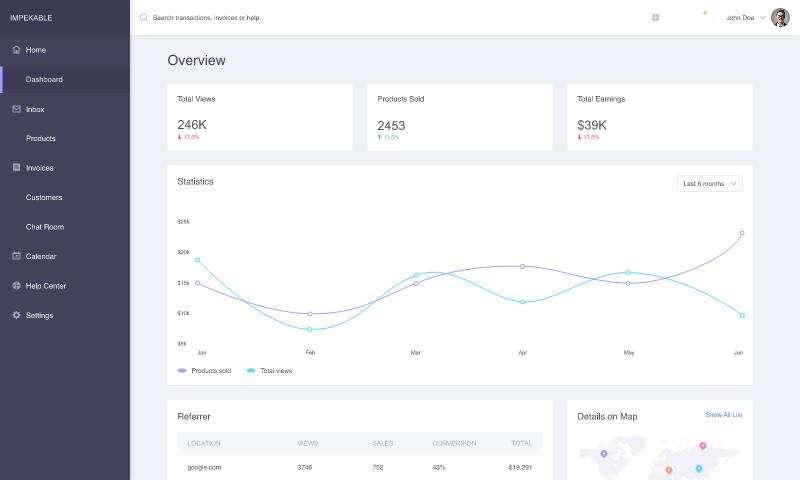

# xd-to-html

**Open Adobe XD `.xd` files as HTML — without Adobe XD.**

```bash
npx xd-to-html ./file.xd -o ./out
open ./out/index.html
```

Node.js 18+ and `unzip` / `zip` on the PATH. One **HTML page per artboard**, as drawn in the file.



**Version:** 1.7.2 · **Last Updated:** 2026-08-25 · **License:** MIT · [Contributing](CONTRIBUTING.md)

## What this is

XD is wound down; the archives are not. This CLI unzips a `.xd`, walks the Scenegraph, and writes SVG-in-HTML you can click through in a browser.

| You get | You do not get |
|---------|----------------|
| Every artboard as a page | A stitched, routed “website” |
| Tap → other artboard (prototype links) | Auto-Animate, component states |
| Thumbnails on the index | Semantic/responsive production CSS |
| Optional `--pages-only` (hide Base/Component/XF boards) | Figma / live-app parity |

Kit files (`wireframe.xd`) export **sheets** (Button, Grid, Colors) plus **Page - \*** boards. Product files (dashboard, church Home, iOS proto) look like full screens because those artboards *are* full screens. `index.html` is a catalog — open the artboard you care about.

## CLI

```bash
npx xd-to-html ./file.xd -o ./out
npx xd-to-html ./file.xd -o ./out --pages-only
node ./cli/fidelity/benchmark-run.js ./file.xd ./out
```

After clone:

```bash
node ./bin/xd-to-html.js ./examples/dashboard.xd -o ./out
open ./out/index.html
```

```
out/index.html           # thumbnail catalog
out/artboards/<slug>.html
out/react/<Name>.jsx     # React components (className, camelCase SVG)
out/react/index.js
out/gold/<slug>.svg
out/benchmark.md         # after bench
```

`--legacy-html` is flattened CSS boxes (debug). `--hide-overlays` strips alternate UI states (off by default).

CI fixture: [`examples/sample.xd`](examples/sample.xd) (Home ↔ About). `npm test` exports it. Live Pages demo: [`examples/dashboard.xd`](examples/dashboard.xd).

## React

Every export also writes `react/` — one JSX component per artboard, plus `react/index.js`. Markup uses `className`, camelCase SVG attrs (`fontFamily`, `clipPath`, `xmlSpace`), and `style={{ ... }}`. Prototype taps accept `hrefs` so you can point them at React Router:

```jsx
import { Home } from "./out/react";

<Home hrefs={{ about: "/about" }} />
```

Copy `out/assets` next to `out/react` so image `href`s (`../assets/...`) resolve. HTML pages stay the static preview; React is additive.

## Fidelity

Default emit is nested SVG (`matrix` per group, clip paths, tspan runs). **Wrap** (HTML ≡ gold) is the CI gate — `npm test` must stay ~100%.

**Scene vs Adobe SVG** (optional files next to your `.xd`, named like the artboard) is 1:1 *performance* vs XD’s exporter. No matching SVG → skipped. A high pixel % can still hide shifted type (backgrounds dominate); check the HTML in a browser. Type uses XD tspan origins; missing fonts still move glyphs.

## Pipeline

Artboards come from `artwork/artboard-*` folders (ids may differ from `resources.artboards`). Tap destinations in `interactions/interactions.json` become hotspot links.

```
.xd → parse-xd → svg-scene → HTML wrap + gold SVG + thumbs
```

Do not put skip/occupancy logic in `convertNode`.

## GitHub Pages

The **Pages** workflow deploys `examples/demo` from `examples/dashboard.xd`. Enable **Settings → Pages → GitHub Actions**.

How to announce the repo: [docs/LAUNCH.md](docs/LAUNCH.md).

## UXP (optional)

Adobe XD → Plugins → Development → Load Plugin… → this folder. The CLI path is the maintained 1:1 export.

## Known limits

- One artboard = one page; no constraint-based reflow.
- Share links / live apps can differ from the `.xd` on disk.
- Symbols are flattened groups.
- Prototypes: tap-to-artboard only (no Auto-Animate).
- Fonts: files inside the `.xd` when present, else `local()` PostScript names.

## Changelog

### 1.7.2 — 2026-08-25

1. Each export writes `react/*.jsx` (JSX attrs, `hrefs` overrides) alongside HTML.

### 1.7.1 — 2026-08-25

1. Public demo is `examples/dashboard.xd` (GitHub Pages + README preview), not a client invoice file.
2. `examples/sample.xd` stays the fast CI wrap fixture.

### 1.7.0 — 2026-08-25

1. Public `examples/sample.xd`, MIT LICENSE, CI, GitHub Pages workflow, `npx` package metadata.
2. Index thumbnails grouped (Screens / Pages / Components / Mobile).
3. Prototype tap → artboard hotspots; `--pages-only` skips kit boards.

### 1.6.4 — 2026-08-25

1. Document any-file CLI usage and wrap vs scene-vs-XD bench.

### 1.6.3 — 2026-08-25

1. Discover artboards from `artwork/artboard-*` folders (and manifest bounds).

### 1.6.2 — 2026-08-25

1. SVG text: start-anchored tspans, same-line runs, PostScript font names.

### 1.6.1 — 2026-08-25

1. `npm run bench`: wrap score and pixel score vs Adobe SVG.

### 1.6.0 — 2026-08-25

1. Nested Scenegraph SVG as the default visual layer, with gold SVG and a wrap harness.
